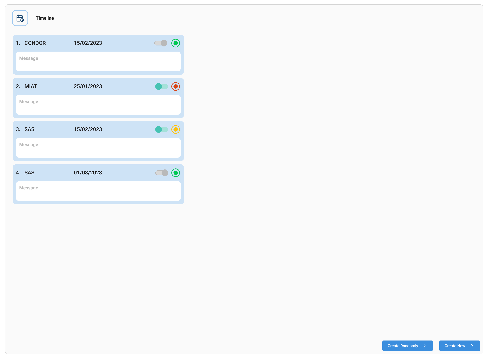

# **Challenge: Building a Support Ticket System**
Your task is to build a Support Ticket System application that allows users to create Support Tickets. The application should consist of a backend API and a frontend interface.

All the icons and other things for the frontend challenge you may need is inside of the `frontend/public` folder

**Requirements:**
1. Backend:
   - [ ] Use TypeScript, MongoDB, Mongoose, and Express.js to create a RESTful API.
   - [ ] Implement the following endpoints:
      - [ ] GET `/tickets`: Retrieve a list of all tickets sorted by deadline desc.
      - [ ] POST `/tickets`: Create a new ticket.
      - [ ] PUT `/tickets/{id}`: Update the ticket.
   - [ ] Each ticket should have the following properties: `client`, `issue`, `status('open', 'closed')` and `deadline`.
   - [ ] **(Extra)** Create an endpoint called GET `/report` which it will query all the tickets inside the database, and it will generate a XLSX file with the columns: `client`, `issue` and `status` 

2. Frontend:
   - [ ] Use TypeScript, ReactJS, Material UI, and Styled Components to create the user interface.
   - [ ] The frontend should display a list of tickets, including their client name, issue message, deadline and status.
   - [ ] The ticket status should be an icon with variants in 3 colors depending on the following cases:
      - [ ] Green: status = closed
      - [ ] Yellow: status = open AND today < deadline
      - [ ] Red: status = open AND today > deadline
   - [ ] Users should be able to change tickets status using a slider button
   - [ ] Include a button that will generate random ticket with dates between now - 2 days and now + 2 days, random client name, random issue message and save it using the REST API every time it's clicked
   - [ ] Tip: Use Debounce to avoid concurrent generation of tickets.
   - [ ] **(Extra)** Create a button in the frontend that will call the GET `/report` endpoint and it will let the user download the generated report. 

**Check the UI images at the end of the requirements.**
3. General Requirements:
   - [ ] Use appropriate error handling and validation techniques throughout the application.
   - [ ] Write clean and maintainable code, following SOLID principles and design patterns.
   - [ ] Provide clear instructions on how to set up and run the application.

4. Extra
   - [ ] Include unit tests for critical parts of the application (e.g., API endpoints, data validation).
   - [ ] Containerize both applications using docker
   - [ ] Provide a docker compose file to spin up the application locally.

   

**Deliverables:**
- Provide a GitHub repository with your code.
- Include a README file with instructions on how to set up and run the application.
- You can also include any additional documentation or comments to explain your design choices or assumptions.